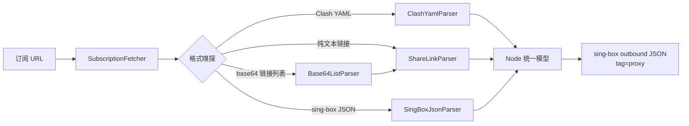
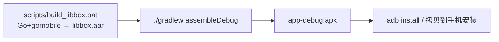

# 机场（Airport）— 安卓代理客户端设计文档

> 基于 sing-box 的安卓代理客户端：订阅 URL 导入 → 节点解析 → 一键连接。
> 对应源码版本：`app-debug.apk`（MVP 0.1.0）

---

## 1. 项目概述

| 项 | 内容 |
|---|---|
| 应用名 | 机场 |
| 包名 | `com.airport.app` |
| 核心引擎 | sing-box v1.13.19（`experimental/libbox` + 自研薄绑定） |
| 语言 | Kotlin 2.0.21 / Jetpack Compose (Material 3) / Go 1.25 |
| 最低系统 | Android 8.0（API 26） |
| 目标系统 | Android 15（API 35） |
| 数据库 | Room 2.6.1 |
| 网络 | OkHttp 4.12（订阅下载） |
| 许可证 | GPL-3.0（依赖 sing-box 核心） |

## 2. 总体架构

```
┌─────────────────────────────────────────────────┐
│  UI 层（Compose）                                │
│   ProfilesScreen  SubscriptionsScreen  Settings │
│   连接开关 / 节点列表 / 订阅管理                    │
└──────────────┬──────────────────────────────────┘
               │ StateFlow / ViewModel
┌──────────────▼──────────────────────────────────┐
│  业务层                                          │
│   SubscriptionRepository（抓取→解析→入库）         │
│   CoreController（连接状态/授权流程）              │
└──────┬───────────────────────────┬──────────────┘
       │ Room                       │ start/stop
┌──────▼──────────┐        ┌────────▼─────────────┐
│  数据层          │        │ 核心层               │
│  subscriptions  │        │  TunService          │
│  profiles       │        │  （VpnService +      │
│  settings       │        │   PlatformInterface）│
└─────────────────┘        └────────┬─────────────┘
                                    │ JNI (gomobile)
                             ┌──────▼─────────────┐
                             │  Go 核心 (libbox.aar)│
                             │  sing-box 引擎      │
                             │  TUN / 路由 / DNS   │
                             └────────────────────┘
```

### 三层职责

1. **UI 层**：三个 Tab（节点 / 订阅 / 设置），ViewModel 持有 UI 状态。
2. **业务+数据层**：订阅抓取与解析（格式嗅探），Room 持久化，DataStore 存选中节点。
3. **核心层**：`TunService` 前台服务承载 sing-box；`ConfigBuilder` 生成隧道配置；
   `PlatformInterface` 实现 TUN 建立、socket 保护、网络信息上报。

## 3. 核心模块

### 3.1 订阅解析（`subscription/`）



支持的分享链接协议：**vless / vmess / trojan / shadowsocks / hysteria2 / tuic**；
Clash 额外支持 **socks5 / http** 类型。SSR、WireGuard 等暂不支持（解析时跳过）。

### 3.2 核心集成（`core/`）

| 文件 | 职责 |
|---|---|
| `ConfigBuilder.kt` | 节点 outbound → 完整 sing-box JSON（TUN inbound + DNS DoH 走代理 + 私网直连路由） |
| `TunService.kt` | 前台服务；实现 `libbox.PlatformInterface`（openTun 建立 VpnService、protect socket、网络监控上报）与 `ServiceHandler` |
| `CoreController.kt` | 连接状态 StateFlow、VPN 授权流程（`VpnService.prepare` → 授权回调 → 继续连接） |

Go 绑定（`core/` 目录，gomobile 编译）对官方 `experimental/libbox` 的薄封装：
`Setup` / `Version` / `CheckConfig` / `NewService`（内部完成平台接口适配注入）/ `BoxService`.

### 3.3 连接流程

1. 用户点开关 → `CoreController.start(profile)`
2. 检查 VPN 授权：未授权 → `vpnAuthRequired` 事件 → MainActivity 启动授权页 → 回调后继续
3. `TunService` 前台服务启动 → `Libbox.setup` → `newService` → `startService(configJson)`
4. sing-box 解析配置 → 回调 `openTun(options)` → VpnService.Builder 建立 TUN → 返回 fd
5. 隧道运行：流量经 TUN → sing-box 路由 → 代理节点；通知栏显示"已连接"
6. 断开：`stopService` → 释放 TUN → 更新状态

## 4. 数据模型

```
subscriptions(id, url, name, userAgent, lastUpdatedAt, trafficUsed, trafficTotal, expireAt)
profiles(id, subscriptionId, name, protocol, server, port, link, outbound)
settings(DataStore): selectedProfileId
```

`Subscription-Userinfo` 响应头解析：流量用量/总量、到期时间（展示于订阅卡片）。

## 5. 构建与发布



详见 [README.md](README.md)。

## 6. 里程碑回顾

| 里程碑 | 内容 | 状态 |
|---|---|---|
| M0 | 环境补齐（JDK 17 / Go / Android SDK+NDK / Gradle） | ✅ |
| M1 | 工程骨架（Gradle 配置、version catalog、wrapper） | ✅ |
| M2 | libbox.aar 构建（Go 绑定 + gomobile） | ✅ |
| M3 | 数据层 + 订阅模块（Room + 解析器 + 单测） | ✅ |
| M4 | 核心层（ConfigBuilder + TunService + CoreController） | ✅ |
| M5 | UI（订阅/节点/连接/设置） | ✅ |
| M6 | 打包 APK | ✅ |

## 7. 后续迭代路线（非 MVP）

- [ ] 延迟测速（对节点发起探测并展示延迟）
- [ ] 订阅定时自动更新（WorkManager）
- [ ] 多节点并存 + selector 热切换（无需重连）
- [ ] 路由规则（国内直连 GeoIP/GeoSite、自定义规则）
- [ ] 分应用代理（excludePackage/includePackage）
- [ ] 流量统计图表、深色模式跟随系统（已支持）
- [ ] 发布签名（正式 release APK）
- [ ] SSR / WireGuard 协议解析
